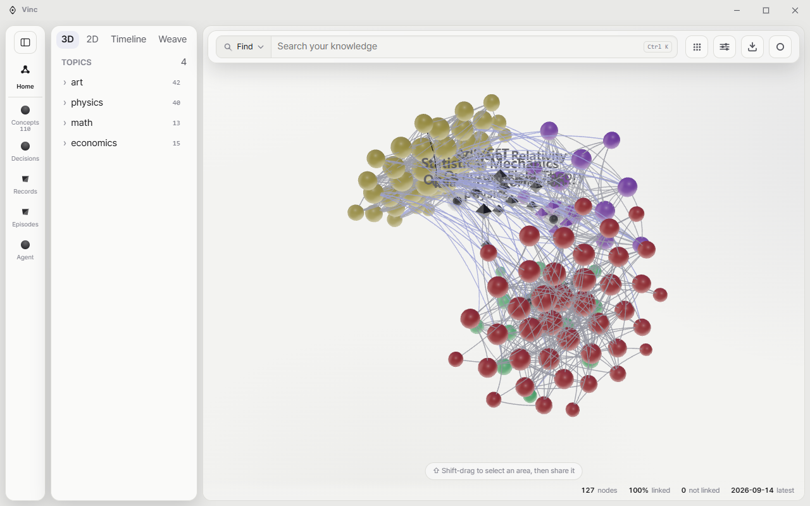

  <picture>
    <source media="(prefers-color-scheme: dark)" srcset=".github/assets/mark-dark.svg">
    
  </picture>

<h1 align="center">Vinc</h1>

  Structure knowledge. Connect meaning. Compose agents. 
  A knowledge graph that runs on your own machine.

  
  
  
  

  <a href="https://vincs.io">Website</a> ·
  <a href="https://vincs.io/download">Download</a> ·
  <a href="https://vincs.io/docs/">Docs</a> ·
  <a href="https://vincs.io/docs/book/">The book</a> ·
  <a href="https://vincs.io/release">Release notes</a>

  <picture>
    <source media="(prefers-color-scheme: dark)" srcset=".github/assets/app-dark.png">
    
  </picture>

## Download

Every link below always points at the newest release.

| | | |
|---|---|---|
| **macOS** | Apple silicon | [`Vinc-aarch64.dmg`](https://github.com/Vinculums/Vincs-app/releases/latest/download/Vinc-aarch64.dmg) |
| **Windows** | x64 | [`Vinc-x64-setup.exe`](https://github.com/Vinculums/Vincs-app/releases/latest/download/Vinc-x64-setup.exe) |
| **Linux** | AppImage | [`Vinc-amd64.AppImage`](https://github.com/Vinculums/Vincs-app/releases/latest/download/Vinc-amd64.AppImage) |
| **Linux** | Debian, Ubuntu | [`Vinc-amd64.deb`](https://github.com/Vinculums/Vincs-app/releases/latest/download/Vinc-amd64.deb) |

Fedora and openSUSE use the `.rpm` on the [releases page](https://github.com/Vinculums/Vincs-app/releases/latest), and an `.msi` is there too for managed Windows installs. If you would rather the site pick for you: [vincs.io/download](https://vincs.io/download).

## What it is

You drop in notes, transcripts and papers. Vinc keeps the canonical text and links the concepts, records, decisions and episodes that run through them, so that later you can ask what you already knew and get an answer with its sources attached.

The graph is the point. A note that sits in a folder is a note; a note that is tied to the decision it caused, the record that measured it and the episode it happened in is something you can ask questions of. Vinc does that linking as you write, and shows the result as a space you can move through rather than a list you scroll.

It runs on your machine. The desktop app needs no account and no sign-in, it works with no network, and there is no telemetry in it. Your documents and graph live in one folder you control. There is an optional web account at [vincs.io](https://vincs.io) for syncing a topic you choose and for connecting an assistant, and it is opt in: what you do not select never leaves the device.

Assistants reach it over [MCP](https://vincs.io/docs/mcp/). Claude, ChatGPT, Cursor and anything else that speaks the protocol can search your graph, read a document and write back what you decided, against your graph and nobody else's.

## First launch

**Vinc is not code-signed yet**, so macOS Gatekeeper or Windows SmartScreen will warn you the first time you open it. The steps to get past that, per platform, are on [vincs.io/download](https://vincs.io/download) under First launch.

Updates are a separate matter and they are signed: each release carries a `latest.json` whose signature the app checks before it installs anything.

## This repository

It hosts the published installers and nothing else. The application source is maintained privately; what ships here is the build.

- Report something broken or unsafe: [support@vincs.io](mailto:support@vincs.io) or [vincs.io/support](https://vincs.io/support)
- What changed in each version: [vincs.io/release](https://vincs.io/release)

  © 2026 Vinc · MIT Licence · <a href="https://vincs.io/privacy">Privacy</a> · <a href="https://vincs.io/terms">Terms</a>

