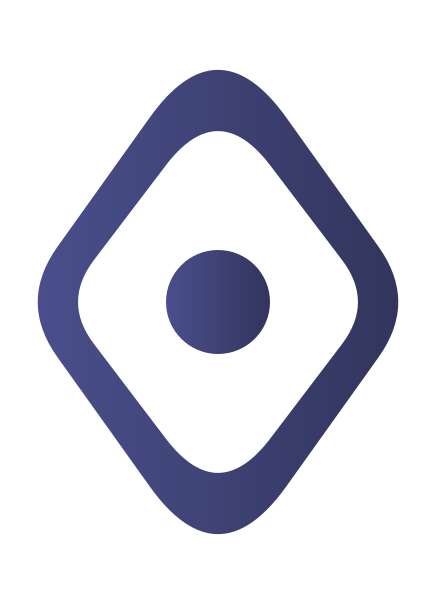
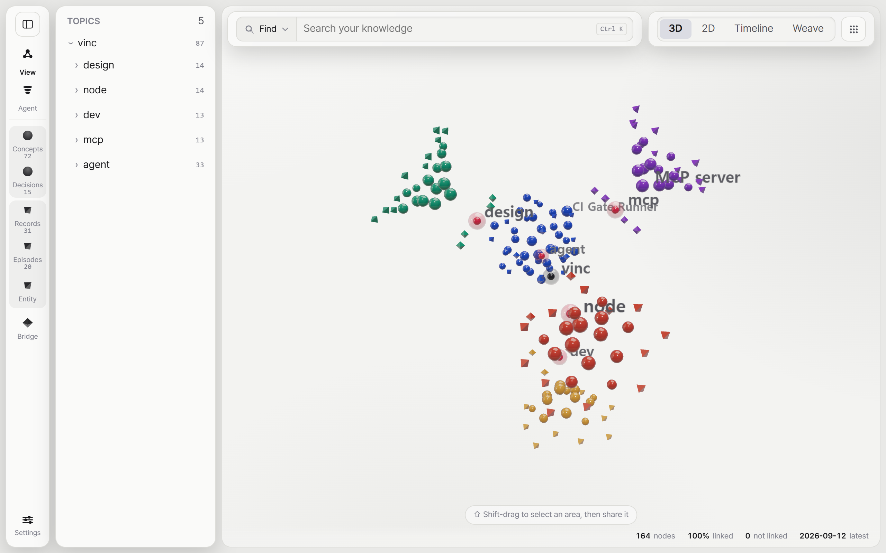
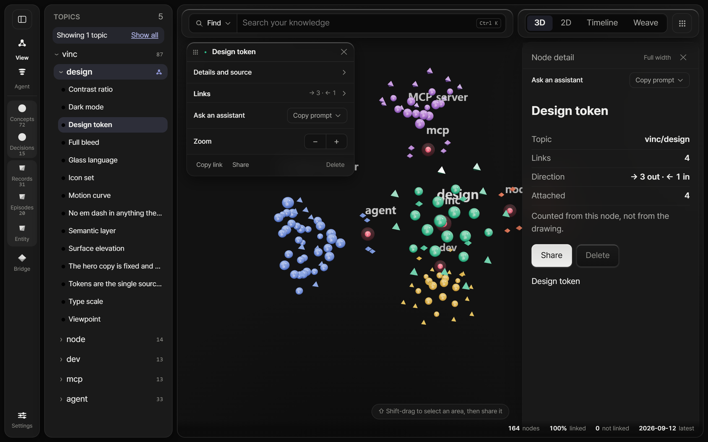
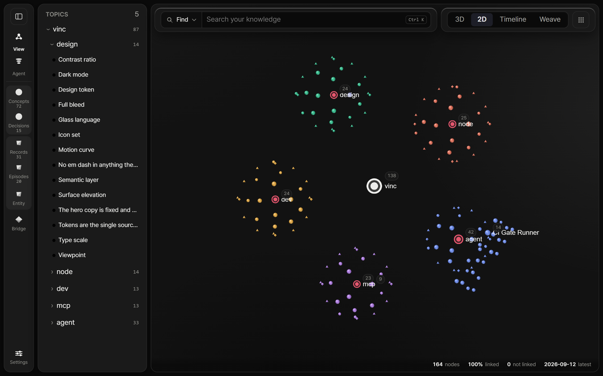
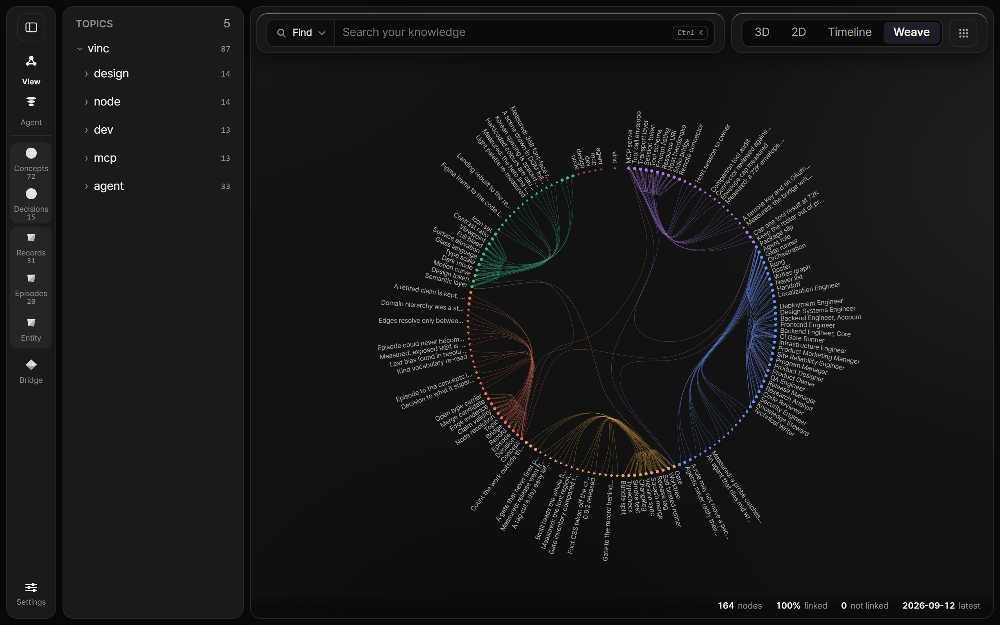
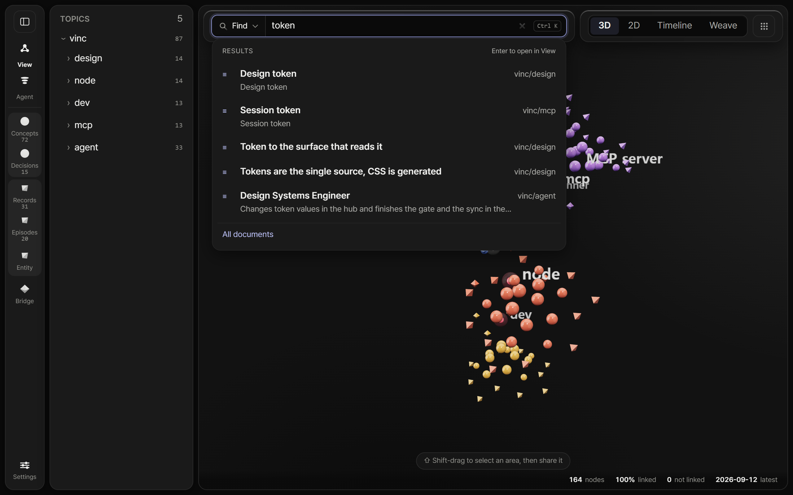
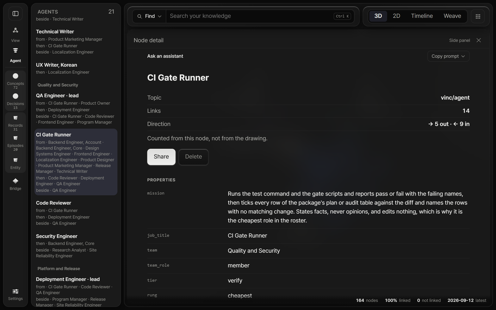

<p align="center">
  <picture>
    <source media="(prefers-color-scheme: dark)" srcset=".github/assets/mark-dark.svg">
    
  </picture>
</p>

<h1 align="center">Vinc</h1>

<p align="center">
  Meet a new system for knowledge. Connect meaning. Compose Agents.
</p>

<p align="center">
  <a href="https://github.com/Vinculums/Vincs-app/releases/latest"></a>
  <a href="https://github.com/Vinculums/Vincs-app/releases"></a>
  <a href="https://vincs.io/docs/"></a>
  <a href="LICENSE"></a>
</p>

<p align="center">
  <a href="https://vincs.io">Website</a> ·
  <a href="https://vincs.io/demo/">Live demo</a> ·
  <a href="https://vincs.io/docs/">Docs</a> ·
  <a href="https://vincs.io/docs/mcp/">MCP setup</a> ·
  <a href="https://vincs.io/release">Release notes</a>
</p>

Vinc is a knowledge operating system for your desktop. Bring in documents and notes, see how concepts, decisions and records connect across four viewpoints, and let the AI assistants you already use read and write **the same graph** over MCP.

- **One graph on every screen.** Once you sign in, the desktop app shows the graph in your account: the same one the web app shows, and the same one an assistant reaches at `mcp.vincs.io`. There is one copy, so there is nothing to sync.
- **Answers quote your notes; nothing is generated.** Ask answers *What is X* and *Sources for X* with passages from your own documents, and every node lists the documents behind it. You can check each answer against the text it came from.
- **You decide where it lives and what leaves.** The graph lives in your account by default. Local mode keeps it in a folder you pick, with no copy in the account. To share, select part of the graph and send it as a pack: only that part goes.

<p align="center">
  <picture>
    <source media="(prefers-color-scheme: dark)" srcset="docs/images/hero-3d-dark.png">
    
  </picture>
</p>
<p align="center">
  <em>The public demo graph in 3D. Five topics (design, node, agent, mcp, dev) each take a jewel colour. Shape tells the kind: a sphere is a concept, a tetrahedron a document, an octahedron a bridge.</em>
</p>

## Get started

**1. Download** for your platform. Each link points at the newest release.

| | | |
|---|---|---|
| **macOS** | Apple silicon | [`Vinc-aarch64.dmg`](https://github.com/Vinculums/Vincs-app/releases/latest/download/Vinc-aarch64.dmg) |
| **Windows** | x64 | [`Vinc-x64-setup.exe`](https://github.com/Vinculums/Vincs-app/releases/latest/download/Vinc-x64-setup.exe) |
| **Linux** | AppImage | [`Vinc-amd64.AppImage`](https://github.com/Vinculums/Vincs-app/releases/latest/download/Vinc-amd64.AppImage) |
| **Linux** | Debian, Ubuntu | [`Vinc-amd64.deb`](https://github.com/Vinculums/Vincs-app/releases/latest/download/Vinc-amd64.deb) |

Fedora and openSUSE use the `.rpm`, and managed Windows installs use the `.msi`. Both are on the [releases page](https://github.com/Vinculums/Vincs-app/releases/latest).

**2. Sign in.** The first screen is the sign-in: **Sign in with email**, or **Continue with Google**. Vinc opens your browser to sign in and approve this device, then shows your graph.

**3. Add something.** Drag a document (`.md`, `.txt`, `.rst`, `.pdf`) or a pack (`.vincpack`, `.json`) onto the window, or start from a single note. Or connect an assistant ([Works with](#works-with)) and let it write into the graph.

> **First launch warning.** Vinc is not code-signed yet. On macOS, drag Vinc into Applications and open it; if it is blocked, open System Settings, Privacy & Security, and click **Open Anyway** next to the Vinc message. On Windows, SmartScreen shows "Windows protected your PC": click **More info**, then **Run anyway**. Updates are a separate matter and are signed: the app checks each update's signature before it installs anything.

## See it in action

<p align="center">
  
</p>

Every node can be handed to an assistant as an address. Open a node in View (here, **Design token** from the demo graph), and in its card choose **Ask an assistant**, **Copy prompt**, **Explain this concept**. You get one line to paste into any assistant connected to Vinc:

```text
Explain this concept using only what is in my Vinc graph. …?space=personal#view/trace/concept%3Adesign-0/d1
```

The assistant passes that address to `vinc_graph` and gets the node back with everything one hop away. Abridged, from the demo graph:

```text
vinc_graph  url="…?space=personal#view/trace/concept%3Adesign-0/d1"

{
  "seed": "concept:design-0", "depth": 1, "found": true,
  "nodes": [
    { "id": "concept:design-0",  "label": "Design token",   "kind": "concept",  "domain": "vinc/design" },
    { "id": "decision:design-0", "label": "Tokens are the single source, CSS is generated", "kind": "decision" },
    { "id": "record:design-0",   "label": "Measured: the hero line is 969.6px at the clamp ceiling", "kind": "record" },
    { "id": "concept:design-1",  "label": "Semantic layer", "kind": "concept" }
  ],
  "edges": [
    { "source": "decision:design-0", "target": "concept:design-0", "type": "ABOUT" },
    { "source": "record:design-0",   "target": "concept:design-0", "type": "ATTACHES_TO" },
    { "source": "concept:design-0",  "target": "concept:design-1", "type": "RELATED_TO" }
  ]
}
```

From there the assistant can walk one hop at a time with `vinc_neighbors`, trace how two concepts connect with `vinc_path`, read a whole document with `vinc_doc_get`, and write new nodes and links back with `vinc_ingest`. The full list of `vinc_` tools is in the [MCP docs](https://vincs.io/docs/mcp/).

## What it does

| Capability | What you get |
|---|---|
| **View, four viewpoints** | 3D, 2D, Timeline and Weave over the same graph. Nodes are glass, each topic wears its own jewel colour, and shape tells the kind. A time cursor limits View to what existed at a date, and Flow plays it forward. |
| **Find and Ask** | Find looks up names and keywords (and ranks by meaning on the account graph). Ask answers *What is X* and *Sources for X* by quoting your documents. |
| **Node detail** | For any node: its topic, links out and in, the documents behind it, and its properties. Edit properties in place as text, list, number, yes or no, or JSON. If the node changed after you started editing, Vinc does not save over it. |
| **Add knowledge** | Drag in `.md`, `.txt`, `.rst` or `.pdf`, or write a node by hand as a concept, a record or a decision. |
| **Packs** | Shift-drag to select an area, or start from a node, and share it as a `.vincpack`. Records and decisions travel with it. Import a pack, or double-click one, and it joins your graph. |
| **Agent roles** | Roles are nodes in your graph, listed under **Agent** by team. A role's properties hold its mission and what it must never do, and **Work as this role** copies a prompt that hands the role to an assistant. |
| **Spaces** | Switch between your personal graph and a team's shared graph in Settings, Account · storage. Every screen follows the space you pick. |
| **MCP** | Web assistants reach the graph in your account at `https://mcp.vincs.io/mcp`. Settings, AI connections shows it with a **Copy address** button. |
| **Local mode** | Settings, Account · storage, **Keep the graph on this device**: the graph lives in a folder you pick and your account holds no copy. |
| **Updates** | The app checks for a new release and offers to install it. The update's signature is checked before anything is installed. |

<table>
  <tr>
    <td width="50%"></td>
    <td width="50%"></td>
  </tr>
  <tr>
    <td><em>2D: the same graph, flat. Each topic gathers around its hub.</em></td>
    <td><em>Weave: every node on the ring by topic, and only the links cross the middle.</em></td>
  </tr>
  <tr>
    <td></td>
    <td></td>
  </tr>
  <tr>
    <td><em>Find: type <code>token</code> and the matching nodes come back with their topic. Enter opens the pick in View.</em></td>
    <td><em>Agent: roles grouped by team, with who each one works from and hands off to. CI Gate Runner carries its mission, team and tier as properties.</em></td>
  </tr>
</table>

## Works with

Assistants connect to the graph in your account through one address: `https://mcp.vincs.io/mcp`. A team's shared graph has its own address, `https://mcp.vincs.io/t/<team-id>/mcp`, shown on the team page. Each host signs in to your Vinc account the first time.

| Host | How to add Vinc |
|---|---|
| **ChatGPT** | Add a custom connector with the address (ChatGPT keeps custom connectors behind developer mode). |
| **claude.ai** | Customize, Connectors, Add custom connector, then paste the address. Claude Desktop, signed in, uses the same connectors. |
| **Claude Code** | `claude mcp add --scope user --transport http vinc https://mcp.vincs.io/mcp`, then run `/mcp` in a session, choose vinc and authenticate. |
| **Codex CLI** | `codex mcp add vinc --url https://mcp.vincs.io/mcp`, then `codex mcp login vinc`. |
| **Cursor, Zed, Windsurf, Copilot and others** | Point the host's MCP configuration file at the address. |

Step by step, per host: [vincs.io/docs/mcp](https://vincs.io/docs/mcp/).

## Your data

- **By default the graph lives in your account.** The desktop app sends each read and write to your account through its local engine. The key for this device is kept in the system keychain; where there is no keychain, it is kept in the app's own folder, where anything running as your user can read it.
- **Local mode keeps it on this device.** The graph lives in a folder you pick and your account holds no copy. You still sign in. Vinc warns you if the folder is synced by a cloud drive or sits on a network drive, because a copy taken while Vinc is writing can break the graph.
- **What was already on this device stays there.** If this device holds a graph from an earlier version, Vinc keeps opening it from this device. Turning local mode off moves every topic on the device to your account, after you confirm, and leaves the folder as it is.
- **Sharing is a pack you choose.** A pack carries only the part of the graph you selected.
- The app ships no analytics or tracking library. It contacts GitHub Releases to check for updates.

## Troubleshooting

**macOS or Windows will not open the app.** Vinc is not code-signed yet. Follow the steps under [Get started](#get-started), or the [download page](https://vincs.io/download).

**The screens are empty after sign-in.** If a line at the top says Vinc can't reach your account, the graph is in the account and the screens stay empty until the connection is back: press **Try again**. On a new account the graph is simply empty: add a file.

**Does it work offline?** The first sign-in needs a network. In the default account mode the app needs to reach your account. Local mode reads the graph from a folder on this device.

**A graph I made before signing in is not on the web.** It stayed on this device. To move it into your account, turn off local mode in Settings, Account · storage. Vinc asks before it moves anything.

**A large file will not import.** In account mode a single import has a size limit, and a PDF reaches it sooner than text. Vinc says so when a file is over it: split the file.

**An assistant cannot open a node address.** Check that the assistant is signed in to the same Vinc account, and that the `space` in the address is one you can reach.

## This repository

It hosts the published installers and nothing else. The application source is maintained privately; what ships here is the build.

- Report something broken or unsafe: [support@vincs.io](mailto:support@vincs.io) or [vincs.io/support](https://vincs.io/support)
- What changed in each version: [vincs.io/release](https://vincs.io/release)

<p align="center">
  <sub>© 2026 Vinc · MIT Licence · <a href="https://vincs.io/privacy">Privacy</a> · <a href="https://vincs.io/terms">Terms</a></sub>
</p>
